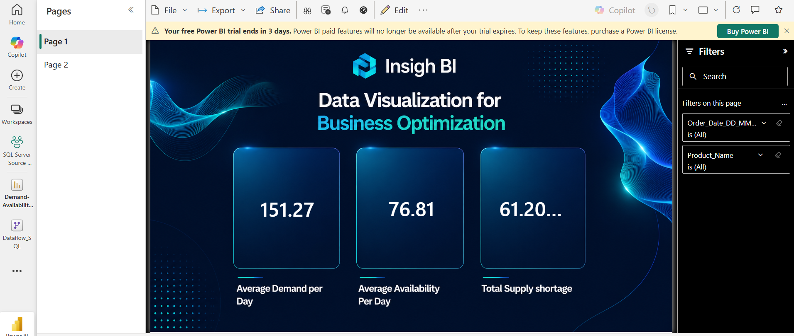
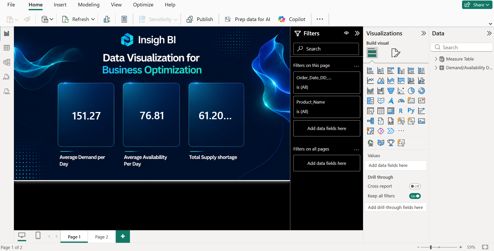

# 🔄 Power BI Data Migration — SQL Server to MySQL

## 📌 Project Overview

This project demonstrates the migration of a Power BI report from a **SQL Server data source to MySQL** while maintaining compatibility with the existing Power BI report structure.

The dashboard itself is used as the **validation layer** to confirm that the report continues to work after the underlying data source is changed.

### Migration Flow

```text
SQL Server
    ↓
Power BI Report
    ↓
Published to Power BI Service
    ↓
MySQL Replacement Source
    ↓
Schema / Column Matching
    ↓
Power Query Source Change
    ↓
Power BI Desktop
    ↓
Report Validation
```

---

## 🎯 Project Objective

The main objective was to replace the original SQL Server source with a MySQL source while keeping the Power BI report compatible with the existing model.

The migration involved:

- Preparing the original SQL Server data.
- Recreating the required data structure in MySQL.
- Matching MySQL column names with the existing Power BI schema.
- Using column aliases where necessary.
- Changing the Power BI source through Power Query's Advanced Editor.
- Comparing the SQL Server and MySQL versions of the report to validate the migration.

---

# 🗄️ Source Systems

## 1. SQL Server — Original Source

The original Power BI report was built using data prepared in SQL Server.

The SQL Server workflow included data preparation involving inventory and product information before creating the table used by Power BI.

The SQL Server query file is included in the repository for reference.

---

## 2. MySQL — Migration Source

The same reporting structure was recreated using MySQL.

To maintain compatibility with the existing Power BI model, the MySQL query uses aliases to match the expected Power BI field names.

Examples include fields such as:

- `Order_Date_DD_MM_YYYY`
- `Product_ID`
- `Product_Name`
- `Unit_Price`

This allowed the existing Power BI report structure to continue working after the source was changed.

---

# 🔧 Migration Process

## Step 1 — Prepare the SQL Server Source

The original report was created using the SQL Server data source and published to **Power BI Service**.



---

## Step 2 — Recreate the Data in MySQL

The equivalent reporting data was prepared in MySQL.

Column aliases were used so that the resulting MySQL dataset matched the existing Power BI field names.

This reduced the amount of restructuring required inside the Power BI report.



---

## Step 3 — Change the Power BI Source

After preparing the MySQL dataset, the existing Power BI report was updated through **Power Query**.

The source was changed using the **Advanced Editor** so that the report connected to the MySQL data instead of SQL Server.

The goal was to preserve the existing table and column structure expected by the report.

---

## Step 4 — Validate the Migration

The SQL Server version and MySQL version of the report were compared to confirm that the migrated report continued to display the required information.

### Validation Approach

```text
SQL Server Report
       ↓
Baseline Report

MySQL Report
       ↓
Migrated Report

Baseline ↔ Migrated
       ↓
Validation
```

The two screenshots are included as visual evidence of the source migration.

---

# 📊 Report Validation

The dashboard analysis in this project is intentionally simple because the main focus is **data migration rather than advanced dashboard analysis**.

The report contains KPIs and filtering for fields such as:

- Order Date
- Product Name
- Average Demand per Day
- Average Availability per Day
- Total Supply Shortage

The same reporting structure was validated after changing the underlying source from SQL Server to MySQL.

---

# 🧩 Power Query

Power Query was used to replace the original SQL Server connection with the MySQL source.

The **Advanced Editor** was used to modify the source while keeping the report's expected field structure.

This demonstrates the ability to:

- Work with multiple relational database sources.
- Modify Power Query source connections.
- Preserve an existing Power BI model during source migration.
- Validate a report after changing the underlying database.

---

# 🗃️ SQL Files

Two SQL scripts are included in the repository:

### SQL Server

The original SQL Server preparation/query used for the Power BI report.

[View SQL Server Query →](SQL%20Server%20Query%20Project%206.sql)

### MySQL

The MySQL query used to recreate the reporting dataset and match the Power BI schema.

[View MySQL Query →](MYSQL%20Query.sql)

---

# 🛠️ Skills Demonstrated

### 🗄️ Databases

- SQL Server
- MySQL
- SQL
- Relational data sources

### 🔄 Data Migration

- Source replacement
- Schema compatibility
- Column aliasing
- Data-source migration
- Report validation

### 📊 Power BI

- Power Query
- Advanced Editor
- Data-source configuration
- Existing-model preservation
- Power BI Service publishing

---

## ⚙️ Tools & Technologies

`Power BI` • `Power Query` • `SQL Server` • `MySQL` • `SQL` • `Power BI Service`

---

## 📁 Project Structure

```text
PowerBI-Data-Migration/
│
├── README.md
├── PowerBI-Data-Migration.pbix
├── SQL Server Query Project 6.sql
├── MYSQL Query.sql
│
└── images/
    ├── sql-server-version.png
    └── mysql-version.png
```

---

# ✅ Conclusion

This project demonstrates a practical **Power BI source migration workflow**.

The report was originally connected to SQL Server and published to Power BI Service. A corresponding MySQL dataset was then prepared with compatible field names, the Power BI source was changed through Power Query, and the resulting report was validated against the original version.

### Migration Summary

**SQL Server → MySQL → Power Query Source Change → Power BI Validation**
